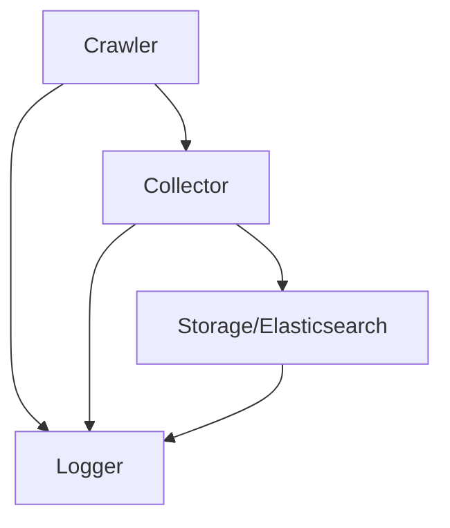

# Architecture

The Go Web Crawler is built using a modular architecture with dependency injection using Uber's FX framework. The system is composed of several key components that work together to crawl web pages and store the results.

## High-Level Architecture



## Core Components

### 1. Crawler (`internal/crawler`)
- Manages the crawling process
- Configures crawling parameters (depth, rate limiting)
- Coordinates between collector and storage
- Handles error management and retries

### 2. Collector (`internal/collector`)
- Built on top of Colly framework
- Handles the actual web page collection
- Manages rate limiting and concurrent requests
- Implements robots.txt compliance
- Handles URL filtering and validation

### 3. Storage (`internal/storage`)
- Elasticsearch integration for document storage
- Handles document indexing and retrieval
- Manages connection pooling and retries
- Implements data schema and mapping

### 4. Logger (`internal/logger`)
- Structured logging using Zap
- Different log levels for development/production
- Performance-optimized logging
- Context-aware logging capabilities

## Dependency Injection

The application uses Uber's FX framework for dependency injection:

```go
app := fx.New(
    crawler.Module,
    collector.Module,
    storage.Module,
    logger.Module,
    config.Module,
)
```

## Module Structure

```
internal/
├── collector/
│   ├── module.go    # FX module definition
│   └── collector.go # Core collector logic
├── config/
│   ├── module.go    # FX module definition
│   └── config.go    # Configuration management
├── crawler/
│   ├── module.go    # FX module definition
│   └── crawler.go   # Main crawler logic
├── logger/
│   ├── module.go    # FX module definition
│   └── logger.go    # Logging implementation
└── storage/
    ├── module.go    # FX module definition
    └── storage.go   # Storage implementation
```

## Data Flow

1. The crawler receives a starting URL and configuration
2. The collector fetches pages according to configuration
3. Page content is processed and validated
4. Valid content is sent to storage
5. All operations are logged with appropriate context

## Error Handling

- Structured error types for different failure scenarios
- Graceful degradation on temporary failures
- Automatic retries with exponential backoff
- Comprehensive error logging and monitoring

## Configuration Management

- Environment-based configuration
- Command-line flags for runtime options
- Validation of required configuration
- Secure handling of sensitive data

## Testing Strategy

- Unit tests for individual components
- Integration tests for component interactions
- Mock implementations for external dependencies
- Comprehensive test coverage requirements
