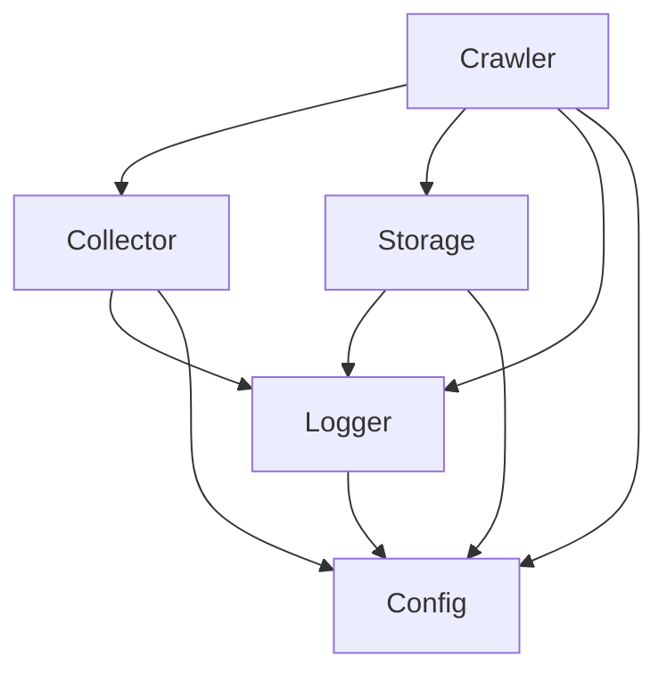

# Components

This directory contains detailed documentation for each core component of the Go Web Crawler.

## Component Overview

### [Crawler](crawler.md)
The main orchestrator that coordinates the crawling process:
- Manages crawling lifecycle
- Handles configuration and parameters
- Coordinates between components
- Implements error handling and retries

### [Collector](collector.md)
Built on the Colly framework, responsible for web page collection:
- Configures and manages the Colly collector
- Implements rate limiting and concurrency
- Handles URL filtering and validation
- Manages robots.txt compliance

### [Storage](storage.md)
Elasticsearch-based storage implementation:
- Document indexing and retrieval
- Connection management
- Schema definition and mapping
- Error handling and retries

### [Logger](logger.md)
Structured logging using Uber's Zap:
- Multiple log levels
- Development and production configurations
- Performance optimization
- Context-aware logging

### [Config](config.md)
Configuration management:
- Environment variable handling
- Command-line flag parsing
- Configuration validation
- Secure credential management

## Component Dependencies

## Common Patterns

Each component follows these common patterns:

1. **Dependency Injection**
   - Uses Uber FX for dependency management
   - Clear separation of concerns
   - Testable component boundaries

2. **Interface Definitions**
   - Clear interface contracts
   - Mock implementations for testing
   - Pluggable implementations

3. **Error Handling**
   - Structured error types
   - Context-aware errors
   - Proper error propagation

4. **Configuration**
   - Environment-based configuration
   - Validation of required settings
   - Secure handling of credentials

5. **Testing**
   - Unit tests with mocks
   - Integration tests
   - Comprehensive test coverage
